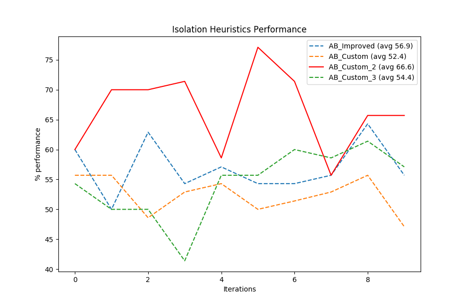

# AIND "_Build a Game-Playing Agent_"

# Isolation

The following document describes and analyze the heuristics implemented for the
variant of the game _Isolation_.

All the code snippets may be incomplete as they are part of larger functions/methods, all implemented in _python_ if not specified otherwise, although could be modified for readability purposes.

## Heuristics Analysis

All the implemented heuristic are positional based.

### "AB_Custom" heuristic (_custom_score_)

The heuristic consist of the number of my moves which can be in the opponent moves, this is a sort of an attack strategy to basically leave the oppponent with minimum options possible for the next move.

```
coll_moves = 0
my_moves = game.get_legal_moves(player)
his_moves = game.get_legal_moves(game.get_opponent(player))

for my_move in my_moves:
    coll_moves += 1 if my_move in his_moves else 0

return float(coll_moves)
```

The problem is that the weight of the game state for the player could be sometimes _zero_ when there are moves that can be made to e.g.: avoid potential situations like being in a corner with the opponent too close or step in a move leading to lose the game.

### "AB_Custom_2" heuristic (_custom_score_2_)

The idea behind this heuristic is basically to chase the opponent player, the game state weight for the player is the sum of all the _euclidean_ distance (no sqrt applied - doesn't affect the outcome of the algorithm, it is the same for all the game states)  between the possible position moves of the player and the current position of the opponent, closer the next move location is to the opponent, higher the move location weight is, if the player2 hasn't moved yet, the heuristic assumes that the opponent is too far.


```
max_distance = float((game.height**2)*2)
p2loc = game.get_player_location(game.get_opponent(player))
distance = 0
for p1loc in game.get_legal_moves(player):
	xv = (p2loc[0] - p1loc[0])**2
	yv = (p2loc[1] - p1loc[1])**2
	distance = max_distance - float(xv + yv)
return distance
```

Overall, this heuristic performs very well compared with the rest, simulations showed that most of the time this strategy was effective when the opponent was near the table corners or near corners made by filled positions (or illegal moves).

### "AB_Custom_3" heuristic (_custom_score_3_)

This heuristic basically determines how the player is based on his possible moves and the empy spaces so far, the higher weight for the game state for the player is _zero_ which is the hypothetical case that all the blank spaces belongs to possible moves, but that would mean the opponent already lose. Lower is the weight, less possible moves the player have to avoid losing. 


```
mymoves = len(game.get_legal_moves(player))
blanks = len(game.get_blank_spaces())
return float(mymoves - blanks)
```

## Performance Analysis



The meaning of performance, in this case, is the ratio between the games played and games won, overall after several implementations, all three heuristics performed well playing against non _alpha-beta_ based players. For all the opponent players, only _AB_Custom_2_ (_custom_score_2_) performed with a 66.6% of won games in average, 8 out of 10 won against _AB_Improved_ and 2 out of 10 tying against the same opponent.

Figure \ref{heuristic_performance} describes more or less the performance compared with the rest of the heuristics, as one can notice, the best performance had a peak of 77.1% and 55.7% as the lower one, not good enough but still winning more than half of the games played as either player1 or player2.

The following is a detailed set of 10 iterations which was used to infer the best heuristic and to generate the plot in figure \ref{heuristic_performance} by exercising the _tournament.py_ script.

\newpage

```
Iteration #1
 Match #   Opponent    AB_Improved   AB_Custom   AB_Custom_2  AB_Custom_3 
                        Won | Lost   Won | Lost   Won | Lost   Won | Lost 
    1       Random       9  |   1     6  |   4     6  |   4     7  |   3  
    2       MM_Open      6  |   4     5  |   5     6  |   4     6  |   4  
    3      MM_Center     6  |   4     7  |   3     7  |   3     7  |   3  
    4     MM_Improved    5  |   5     6  |   4     6  |   4     6  |   4  
    5       AB_Open      5  |   5     5  |   5     5  |   5     5  |   5  
    6      AB_Center     6  |   4     5  |   5     5  |   5     5  |   5  
    7     AB_Improved    5  |   5     5  |   5     7  |   3     2  |   8  
--------------------------------------------------------------------------
           Win Rate:      60.0%        55.7%        60.0%        54.3%  
```
\newpage
```
Iteration #2
 Match #   Opponent    AB_Improved   AB_Custom   AB_Custom_2  AB_Custom_3 
                        Won | Lost   Won | Lost   Won | Lost   Won | Lost 
    1       Random       8  |   2     7  |   3     9  |   1     7  |   3  
    2       MM_Open      5  |   5     5  |   5     7  |   3     6  |   4  
    3      MM_Center     4  |   6     6  |   4     7  |   3     4  |   6  
    4     MM_Improved    6  |   4     5  |   5     5  |   5     5  |   5  
    5       AB_Open      3  |   7     5  |   5     7  |   3     3  |   7  
    6      AB_Center     4  |   6     6  |   4     8  |   2     6  |   4  
    7     AB_Improved    5  |   5     5  |   5     6  |   4     4  |   6  
--------------------------------------------------------------------------
           Win Rate:      50.0%        55.7%        70.0%        50.0%    
```
```
Iteration #3
 Match #   Opponent    AB_Improved   AB_Custom   AB_Custom_2  AB_Custom_3 
                        Won | Lost   Won | Lost   Won | Lost   Won | Lost 
    1       Random       7  |   3     5  |   5     9  |   1     6  |   4  
    2       MM_Open      5  |   5     5  |   5     7  |   3     4  |   6  
    3      MM_Center     8  |   2     5  |   5     7  |   3     9  |   1  
    4     MM_Improved    8  |   2     4  |   6     8  |   2     4  |   6  
    5       AB_Open      4  |   6     5  |   5     6  |   4     4  |   6  
    6      AB_Center     6  |   4     4  |   6     6  |   4     3  |   7  
    7     AB_Improved    6  |   4     6  |   4     6  |   4     5  |   5  
--------------------------------------------------------------------------
           Win Rate:      62.9%        48.6%        70.0%        50.0%    
```
```
Iteration #4
 Match #   Opponent    AB_Improved   AB_Custom   AB_Custom_2  AB_Custom_3 
                        Won | Lost   Won | Lost   Won | Lost   Won | Lost 
    1       Random       8  |   2     8  |   2     9  |   1     4  |   6  
    2       MM_Open      4  |   6     4  |   6     7  |   3     4  |   6  
    3      MM_Center     6  |   4     6  |   4     9  |   1     6  |   4  
    4     MM_Improved    5  |   5     4  |   6     6  |   4     2  |   8  
    5       AB_Open      5  |   5     6  |   4     6  |   4     4  |   6  
    6      AB_Center     4  |   6     5  |   5     7  |   3     4  |   6  
    7     AB_Improved    6  |   4     4  |   6     6  |   4     5  |   5  
--------------------------------------------------------------------------
           Win Rate:      54.3%        52.9%        71.4%        41.4%    
```
\newpage
```
Iteration #5
 Match #   Opponent    AB_Improved   AB_Custom   AB_Custom_2  AB_Custom_3 
                        Won | Lost   Won | Lost   Won | Lost   Won | Lost 
    1       Random      10  |   0     8  |   2     9  |   1     8  |   2  
    2       MM_Open      6  |   4     5  |   5     5  |   5     4  |   6  
    3      MM_Center     4  |   6     5  |   5     7  |   3     7  |   3  
    4     MM_Improved    5  |   5     6  |   4     4  |   6     7  |   3  
    5       AB_Open      5  |   5     6  |   4     7  |   3     5  |   5  
    6      AB_Center     5  |   5     3  |   7     4  |   6     5  |   5  
    7     AB_Improved    5  |   5     5  |   5     5  |   5     3  |   7  
--------------------------------------------------------------------------
           Win Rate:      57.1%        54.3%        58.6%        55.7%    
```
```
Iteration #6
 Match #   Opponent    AB_Improved   AB_Custom   AB_Custom_2  AB_Custom_3 
                        Won | Lost   Won | Lost   Won | Lost   Won | Lost 
    1       Random       5  |   5     7  |   3    10  |   0     7  |   3  
    2       MM_Open      5  |   5     3  |   7     7  |   3     4  |   6  
    3      MM_Center     7  |   3     7  |   3     8  |   2     8  |   2  
    4     MM_Improved    7  |   3     3  |   7     8  |   2     5  |   5  
    5       AB_Open      6  |   4     5  |   5     6  |   4     5  |   5  
    6      AB_Center     3  |   7     4  |   6     8  |   2     4  |   6  
    7     AB_Improved    5  |   5     6  |   4     7  |   3     6  |   4  
--------------------------------------------------------------------------
           Win Rate:      54.3%        50.0%        77.1%        55.7%    
```
```
Iteration #7
 Match #   Opponent    AB_Improved   AB_Custom   AB_Custom_2  AB_Custom_3 
                        Won | Lost   Won | Lost   Won | Lost   Won | Lost 
    1       Random       8  |   2     8  |   2     9  |   1     7  |   3  
    2       MM_Open      5  |   5     4  |   6     6  |   4     5  |   5  
    3      MM_Center     7  |   3     4  |   6     8  |   2     5  |   5  
    4     MM_Improved    4  |   6     4  |   6     6  |   4     6  |   4  
    5       AB_Open      5  |   5     6  |   4     8  |   2     7  |   3  
    6      AB_Center     5  |   5     5  |   5     7  |   3     7  |   3  
    7     AB_Improved    4  |   6     5  |   5     6  |   4     5  |   5  
--------------------------------------------------------------------------
           Win Rate:      54.3%        51.4%        71.4%        60.0%    
```
\newpage
```
Iteration #8
 Match #   Opponent    AB_Improved   AB_Custom   AB_Custom_2  AB_Custom_3 
                        Won | Lost   Won | Lost   Won | Lost   Won | Lost 
    1       Random       9  |   1     8  |   2     8  |   2     7  |   3  
    2       MM_Open      7  |   3     5  |   5     4  |   6     6  |   4  
    3      MM_Center     5  |   5     6  |   4     5  |   5     6  |   4  
    4     MM_Improved    4  |   6     5  |   5     5  |   5     6  |   4  
    5       AB_Open      4  |   6     4  |   6     6  |   4     7  |   3  
    6      AB_Center     6  |   4     5  |   5     5  |   5     3  |   7  
    7     AB_Improved    4  |   6     4  |   6     6  |   4     6  |   4  
--------------------------------------------------------------------------
           Win Rate:      55.7%        52.9%        55.7%        58.6%    
```
```
Iteration #9
 Match #   Opponent    AB_Improved   AB_Custom   AB_Custom_2  AB_Custom_3 
                        Won | Lost   Won | Lost   Won | Lost   Won | Lost 
    1       Random       9  |   1     8  |   2     7  |   3     8  |   2  
    2       MM_Open      6  |   4     5  |   5     8  |   2     8  |   2  
    3      MM_Center     8  |   2     8  |   2     8  |   2     6  |   4  
    4     MM_Improved    4  |   6     2  |   8     5  |   5     3  |   7  
    5       AB_Open      5  |   5     6  |   4     4  |   6     5  |   5  
    6      AB_Center     7  |   3     5  |   5     8  |   2     6  |   4  
    7     AB_Improved    6  |   4     5  |   5     6  |   4     7  |   3  
--------------------------------------------------------------------------
           Win Rate:      64.3%        55.7%        65.7%        61.4%    
```
```
Iteration #10
 Match #   Opponent    AB_Improved   AB_Custom   AB_Custom_2  AB_Custom_3 
                        Won | Lost   Won | Lost   Won | Lost   Won | Lost 
    1       Random       6  |   4     5  |   5     9  |   1     7  |   3  
    2       MM_Open      7  |   3     5  |   5     6  |   4     5  |   5  
    3      MM_Center     7  |   3     5  |   5    10  |   0     5  |   5  
    4     MM_Improved    7  |   3     5  |   5     4  |   6     6  |   4  
    5       AB_Open      3  |   7     4  |   6     7  |   3     6  |   4  
    6      AB_Center     4  |   6     4  |   6     5  |   5     4  |   6  
    7     AB_Improved    5  |   5     5  |   5     5  |   5     7  |   3  
--------------------------------------------------------------------------
           Win Rate:      55.7%        47.1%        65.7%        57.1% 
```

---

As one can notice in figure \ref{heuristic_performance}, it is clear that the "_AB_Custom_2_" (_custom_score_2_) outstands among the rest of the heuristic in terms of average performance, overall performance (against all the opponents) and against the _AB_Improved_.

Based on the data and the analysis done over the performance, is recommended to use the "_AB_Custom_2_" (_custom_score_2_), behaves very well playing against _minimax_ based player and could possibly win 80% of the games played either as a plyer1 or player2 against "_AB_Improved_".